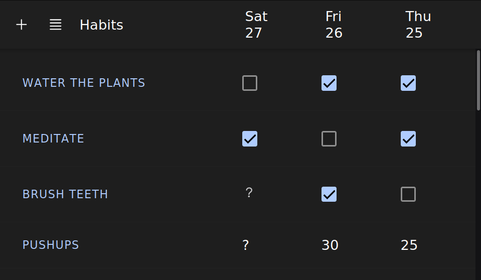

# Habitsync: Habit Tracking App

The goal of this project is to create a habit tracking app that:
- is multiplatform (web, Android and iOS)
- can work offline
- synchronizes data bi-directionally, to interact with the tracker programmatically outside the app  



## Setup

```bash
# Install node.js, then:
npm install
# Adding the external flag to connect from other devices
# on the local network
ionio serve --external
```
